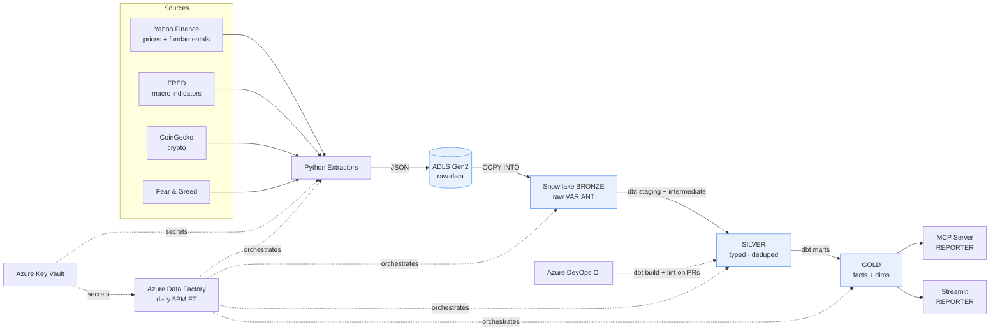
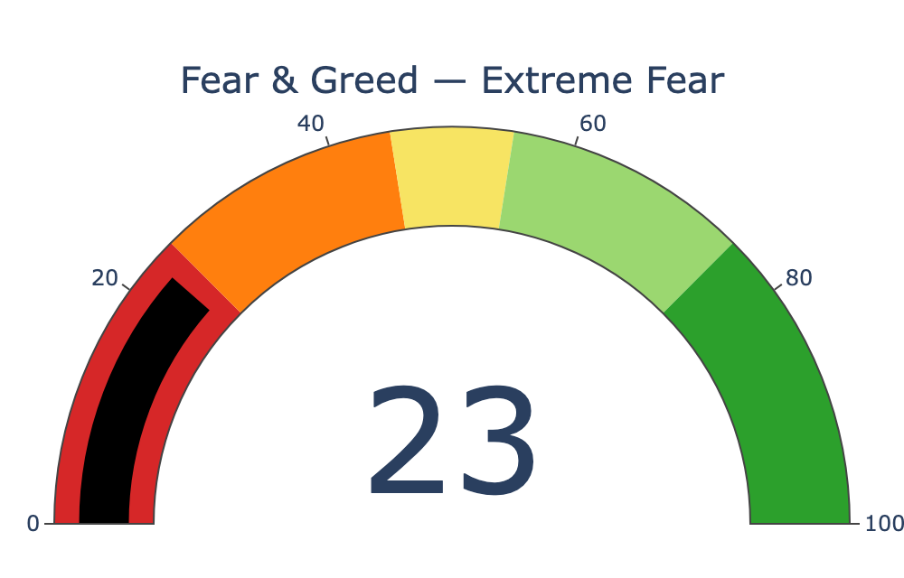
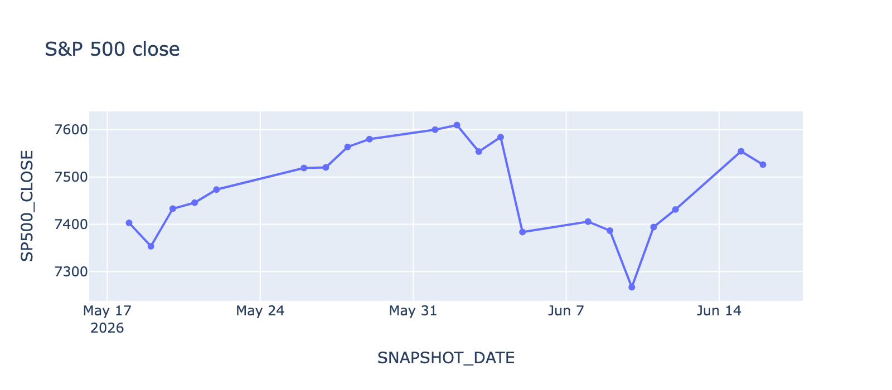
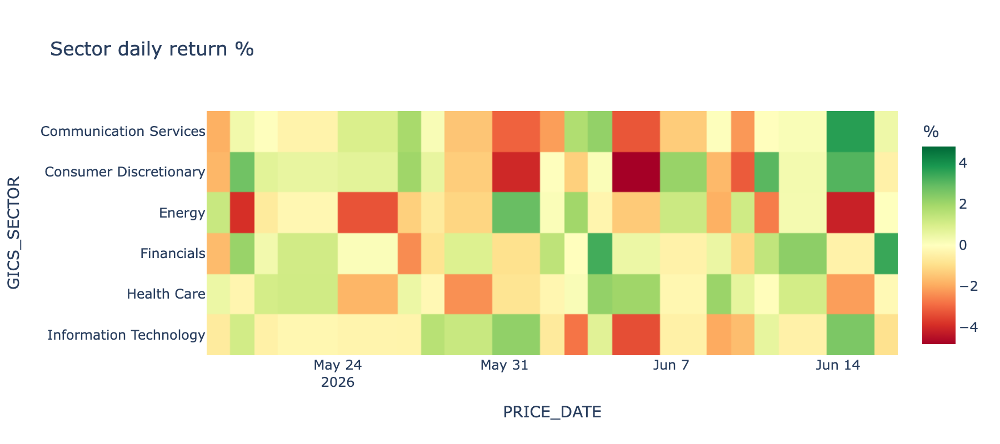
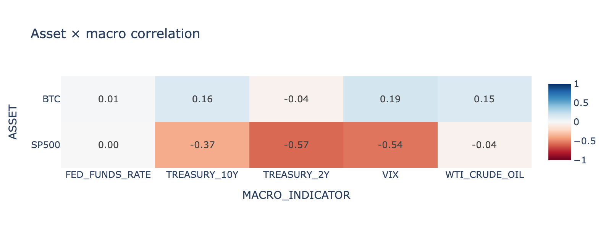
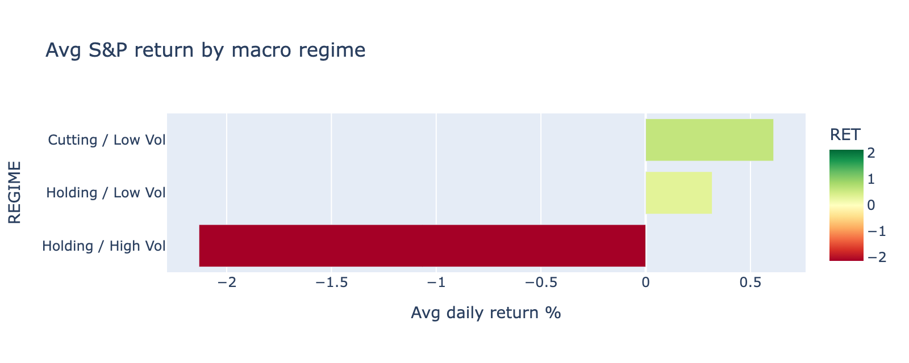

# MacroMarket ELT Pipeline

> An end-to-end, **Azure-native ELT pipeline** that ingests stock, macroeconomic, and
> crypto data from **4 sources** into **Snowflake** using **medallion architecture**
> (Bronze → Silver → Gold), transforms it with **dbt** (30+ models, incremental
> materialization, custom macros, a Python/Snowpark model, 60+ tests), orchestrates it
> with **Azure Data Factory**, and serves the Gold layer to LLMs through an **MCP server**
> and to humans through a **Streamlit dashboard** — all under least-privilege Snowflake RBAC.


**🔗 Links:** [Live docs & dbt lineage](https://ragulnarayanan.github.io/macromarket-elt/) ·
[dbt documentation](https://ragulnarayanan.github.io/macromarket-elt/dbt/) ·
[MCP demo transcript](docs/mcp_demo.md) ·
[Sample Gold data](docs/sample_output/)

---

## Architecture



| Layer | Snowflake schema | Contents | Written by | Read by |
|-------|------------------|----------|-----------|---------|
| **Bronze** | `MACROMARKET.BRONZE` | Raw JSON (VARIANT), append-only | `LOADER` (COPY INTO) | `TRANSFORMER` |
| **Silver** | `MACROMARKET.SILVER` | Typed, deduplicated staging + enriched intermediate | `TRANSFORMER` (dbt) | `TRANSFORMER` |
| **Gold** | `MACROMARKET.GOLD` | Business-ready facts + dimensions | `TRANSFORMER` (dbt) | `REPORTER` (MCP, Streamlit) |

## Data sources

| Source | Data | Method |
|--------|------|--------|
| [Yahoo Finance](https://pypi.org/project/yfinance/) | Daily OHLCV + fundamentals (S&P slice, indices, sector ETFs) | `yfinance` |
| [FRED](https://fred.stlouisfed.org/docs/api/) | 10 macro series (rates, CPI, VIX, GDP, …) | REST API |
| [CoinGecko](https://www.coingecko.com/en/api) | Top-20 crypto by market cap | REST API |
| [Fear & Greed](https://alternative.me/crypto/fear-and-greed-index/) | CNN Fear & Greed index (0–100) | REST API |

## Dashboard (sample visuals)

Rendered from the live Gold layer (Streamlit + Plotly). Source pages in `streamlit/`.

| Fear & Greed | S&P 500 trend |
|:---:|:---:|
|  |  |



| Asset × macro correlation | Returns by macro regime |
|:---:|:---:|
|  |  |

## Tech stack

**Python** · **Snowflake** · **dbt Core** (dbt-snowflake) · **Azure** (ADLS Gen2, Data
Factory, Key Vault, DevOps) · **MCP** (FastMCP) · **Streamlit** · **Plotly**

## Repository layout

| Directory | Purpose |
|-----------|---------|
| `extractors/` | Python extractors + ADLS uploader + Snowflake loader + orchestrator |
| `snowflake/setup/` | DDL scripts, run in order `01` → `06` |
| `azure/` | Azure CLI provisioning (`setup.sh`) + ADF pipeline definitions (`adf/`) |
| `dbt_project/` | dbt models (bronze sources, silver, gold), macros, tests, seeds |
| `mcp_server/` | MCP tools exposing Gold to LLMs (REPORTER role) |
| `streamlit/` | Multi-page dashboard (REPORTER role) |
| `azure-pipelines/` | Azure DevOps CI (`dbt-ci.yml`, `lint.yml`) |

## Quick start (local)

```bash
python -m venv .venv && source .venv/bin/activate
pip install -r extractors/requirements.txt -r dbt_project/requirements.txt
cp .env.example .env                      # fill in Snowflake + ADLS values

# 1. Provision Snowflake: run snowflake/setup/01..06 in a Snowsight worksheet
# 2. Ingest:  extract -> ADLS -> Bronze
python -m extractors.run_all --upload --load
# 3. Transform:  Bronze -> Silver -> Gold
cd dbt_project && dbt deps && dbt build --profiles-dir .
# 4. Explore
streamlit run ../streamlit/app.py          # dashboard
python ../mcp_server/server.py             # MCP server (or wire into Claude Desktop)
```

## Design decisions (the *why*)

- **ELT, not ETL** — load raw into the warehouse first, transform with SQL where the
  compute and data live. dbt makes transformations versioned, tested, and lineage-aware.
- **Medallion (Bronze/Silver/Gold)** — separates immutable raw capture from cleaning from
  business logic, so a bad transform never corrupts the source of truth.
- **ADLS Gen2 as a durable landing zone** — if a Snowflake load fails, retry `COPY INTO`
  from files already in storage instead of re-hitting rate-limited APIs.
- **Least-privilege RBAC** — three roles (`LOADER` writes Bronze, `TRANSFORMER` owns
  Silver/Gold, `REPORTER` reads Gold only). The dashboard and the LLM can only read Gold.
- **Incremental `fct_daily_market_snapshot`** — a growing daily fact that MERGEs only new
  dates each run rather than rebuilding history.
- **MCP server as a governed semantic layer** — the LLM calls typed tools, never raw SQL,
  over a read-only connection; parameterized queries close the injection surface.
- **ADF over Airflow** — Azure-native, no infra to manage, native Snowflake/ADLS connectors,
  pay-per-run.

## Build status

- [x] **Phase 1** — Foundation (Azure + Snowflake setup)
- [x] **Phase 2** — Extractors + Bronze load *(verified: extract → ADLS → COPY INTO)*
- [x] **Phase 3** — dbt Silver *(6 staging models, 3 seeds, tests)*
- [x] **Phase 4** — dbt Gold *(dims, technicals, incremental snapshot, regime, Python correlation model)*
- [x] **Phase 5** — MCP server *(5 read-only Gold tools)*
- [x] **Phase 6** — Azure Data Factory orchestration *(pipelines + trigger as code)*
- [x] **Phase 7** — Streamlit dashboard *(4 pages)*
- [x] **Phase 8** — CI/CD + polish

> Sample Gold outputs are in [`docs/sample_output/`](docs/sample_output/). Detailed specs
> live in `MACROMARKET_ELT_PROJECT_SPEC.md`. Cost: ~\$0 on Snowflake + Azure free tiers
> (X-Small warehouses, 60s auto-suspend, 10-credit resource monitor).
